Workshop — Design Software Architecture

# Lucky Draw System Hồ sơ đề xuất

*Hệ thống bốc thăm trúng thưởng cho chương trình khách hàng thân thiết của một sàn thương mại điện tử. Tài liệu này là bài nộp đầy đủ của nhóm cho phần **Solution proposal** bắt buộc trong đề bài workshop, kèm kế hoạch cho phần demo tuỳ chọn.*

- Hạn nộp · Thứ Sáu 14/8
- Workshop · Thứ Tư 26/8, 14:00–16:00
- Hall B, Lab 6
- Trình bày · 20 phút, 2 người
- Phiên bản · v2.1, khớp sơ đồ kiến trúc đã review
- Công nghệ tham chiếu · Java 17 · Spring Boot · MySQL 8

## 00 Đối chiếu yêu cầu đề bài

*Đề bài workshop nêu sáu mục bắt buộc và một mục tuỳ chọn. Bảng này là thứ cần kiểm tra đầu tiên trước khi nộp: mỗi mục bắt buộc phải có một phần trong tài liệu, một người phụ trách, và một khoảng thời gian trong ngân sách 20 phút. Dòng nào thiếu người hoặc thiếu thời gian là một lỗ hổng.*

| Mục trong đề bài | Phần | Phụ trách | Thời lượng |
| --- | --- | --- | --- |
| 1a · Pattern nào phù hợp với ứng dụng | 1a | Nhóm 1 | 2 phút |
| 1b · Vì sao chọn pattern này thay vì cái khác, kèm kinh nghiệm thực tế | 1b | Nhóm 1 | 4 phút |
| 1c · Sơ đồ thiết kế kiến trúc | 1c | Nhóm 2 | 3 phút |
| 1d · Sơ đồ Package & Class | 1d | Nhóm 3 | 2 phút |
| 1e · Sequence diagram cho các tính năng chính | 1e | Nhóm 3 | 3 phút |
| 1f · Cấu trúc project và các đoạn code chính | 1f | Nhóm 4 | 3 phút |
| 2 · Demo ứng dụng (tuỳ chọn, có thưởng) | 2 | Nhóm 4 | 2 phút |
| Mở đầu, kết thúc, dự phòng Q&A | B | Nhóm 5 | 1 phút |

Có hai điểm trong đề bài rất dễ bỏ sót, nên nêu rõ ra đây. Thứ nhất, mục 1b yêu cầu **so sánh với những phương án đã loại bỏ**, không chỉ bảo vệ phương án đã chọn — toàn bộ mục 1b được dựng theo hướng đó. Thứ hai, đề bài yêu cầu **dẫn kinh nghiệm thực tế nếu có thể**, và đây là phần duy nhất trong tài liệu mà nhóm phải tự cung cấp từ lịch sử làm việc của mình; xem ô được đánh dấu trong mục 1b.

## 01 Bài toán & ràng buộc

Khách hàng là một sàn thương mại điện tử, muốn xây hệ thống bốc thăm trúng thưởng như một phần của chương trình khách hàng thân thiết. Seller cấu hình campaign; khách hàng nhận ticket từ những đơn hàng đủ điều kiện rồi dùng ticket để nộp entry; cuối campaign seller bốc thăm, người thắng được thông báo và nhận thưởng.

#### Các quy tắc lấy từ đề bài

| Quy tắc | Hệ quả lên thiết kế |
| --- | --- |
| Campaign quy định tổng số entry một user được nộp | Cần một bộ đếm atomic theo từng user, enforce ngay trên đường ghi — xem 1d |
| Campaign có ngày bắt đầu và kết thúc | Cần state machine và kỷ luật khoá cho thời điểm giao ranh — Fig 2d, Fig 8 |
| Phần thưởng là sản phẩm hoặc coupon | Hai quy trình giao thưởng khác hẳn nhau sau cùng một interface — Strategy, Fig 2c |
| Đơn hàng trên 1.000.000 nhận đúng một ticket | Ticket gắn với một order, dùng một lần, idempotent theo order id |
| Cuối kỳ seller bốc thăm và người thắng được thông báo | Việc bốc thăm phải idempotent và audit được — Fig 6 |
| Seller rất nổi tiếng; campaign nào cũng đông người tham gia | Tải đọc và tải ghi phải scale độc lập; đường submit không được có hot row |

Dòng cuối cùng là câu quan trọng nhất trong toàn bộ đề bài. Nếu không có nó, một layered monolith trên một database sẽ là câu trả lời đúng và rẻ nhất. Có nó, thiết kế phải chịu được một đỉnh tải dồn dập — và với bốc thăm trúng thưởng, đỉnh tải này đoán trước được chứ không ngẫu nhiên: gần như ai cũng nộp entry trong vài giờ cuối trước hạn.

#### Các mục tiêu phi chức năng mà thiết kế nhắm tới

- **Submit entry** — đường nóng. Mục tiêu p99 dưới 200 ms ở vài nghìn request mỗi giây, với tính đúng đắn dưới tải đồng thời được ưu tiên hơn độ trễ.
- **Analytics read** — tuyệt đối không được tranh chấp tài nguyên với đường submit, dù seller có refresh dashboard bao nhiêu lần đi nữa.
- **Draw** — chạy đúng một lần mỗi campaign. Tính đúng đắn, công bằng và audit được mới quan trọng; độ trễ thì không.
- **Checkout** — không được chậm đi hay lỗi chỉ vì hệ thống lucky draw đang gặp sự cố. Nhận ticket là quyền lợi khách hàng thân thiết, không nằm trong luồng thanh toán.

---

## 1a Pattern nào phù hợp với ứng dụng

*Mục 1a trong đề bài · Phụ trách: Nhóm 1*

*Không có pattern đơn lẻ nào trả lời được đề bài này. Nhóm kết hợp bốn pattern, mỗi cái giải một vấn đề khác nhau mà yêu cầu đặt ra, và nhóm nêu rõ được từng cái dùng để làm gì.*

| Pattern | Áp dụng ở đâu | Yêu cầu nào bắt buộc phải dùng |
| --- | --- | --- |
| **Event-Driven Architecture** | Giữa Order service có sẵn và lucky draw domain | Checkout không được phụ thuộc vào việc phát ticket có sẵn sàng hay không |
| **CQRS** | Bên trong lucky draw domain: tách write side và read side thành hai store riêng | Analytics thiên về đọc và truy vấn tổng hợp; submit entry thiên về ghi và cần transaction. Một store không thể tối ưu cho cả hai khi tải cao |
| **Transactional Outbox** | Mọi service có publish event | Event không được publish nếu thay đổi trong database chưa commit, và ngược lại |
| **Strategy** | Giao thưởng | Phần thưởng là sản phẩm hoặc coupon, và loại thứ ba là hoàn toàn có thể xuất hiện |

Ranh giới service đi theo bounded context của DDD, với một ngoại lệ có chủ đích và rất quan trọng được nói rõ ở mục 1b: **ticket, quota và entry nằm chung một write-side context, dùng chung một database**, vì chúng bắt buộc phải thay đổi cùng nhau một cách atomic. Ranh giới được vạch theo ranh giới transaction, không theo ranh giới bảng hay ranh giới team.

Những gì nhóm **không** đề xuất, nói rõ luôn: chia microservice tới mức mỗi entity một service, event sourcing, hay saga orchestrator. Mục 1b giải thích vì sao từng cái bị loại.

## 1b Vì sao chọn những pattern này thay vì cái khác

*Mục 1b trong đề bài · Phụ trách: Nhóm 1*

### Các phương án đã cân nhắc và loại bỏ

| Phương án | Vì sao nó hấp dẫn | Vì sao nhóm loại bỏ |
| --- | --- | --- |
| **Layered monolith trên một database** | Rẻ nhất để xây và vận hành; một transaction bao hết mọi thứ; không phải giải thích eventual consistency | Truy vấn analytics là một phép tổng hợp trên đúng những dòng mà đường submit đang chèn vào. Lúc campaign sắp hết hạn, khi lượng submit đạt đỉnh, cũng chính là lúc seller theo dõi dashboard nhiều nhất. Đọc và ghi tranh nhau cùng buffer và cùng khoá, và không thể scale bên này mà không scale bên kia |
| **Gọi REST đồng bộ từ Order service sang Ticket service** | Đơn giản, nhất quán tức thì, dễ trace | Nó buộc tính sẵn sàng của checkout vào một tính năng loyalty. Nếu việc phát ticket chậm hoặc chết, hoặc là checkout chậm theo, hoặc là ticket bị mất âm thầm. Cả hai đều không chấp nhận được với một luồng thanh toán, trong khi ticket thật sự không cần tồn tại ngay trong cùng một giây |
| **Mỗi entity một microservice: Ticket, Quota, Entry, Draw** | Cách chia nhìn rất "sách giáo khoa"; mỗi service deploy độc lập được | Tiêu thụ ticket, giữ một suất quota và chèn entry phải cùng xảy ra hoặc không cái nào xảy ra. Tách ra nhiều database thì phải viết saga kèm bước bù trừ — hoàn lại ticket khi hết quota — mà bản thân bước bù trừ cũng dễ lỗi. Nhóm sẽ phải trả cái giá phức tạp của distributed transaction cho một thao tác vốn gọn trong một `BEGIN…COMMIT` |
| **Event sourcing trên luồng entry** | Dấu vết audit hoàn hảo; việc bốc thăm có thể replay lại lịch sử; rất hợp với bài toán "đếm số entry" | Nó mua về một dấu vết audit mà nhóm có thể có được rẻ hơn nhiều bằng một bảng entry bất biến cộng với draw snapshot đã hash, đổi lại phải làm tooling rebuild projection, snapshot, và team phải học nhiều hơn hẳn. Không đáng cho một lượt bốc thăm chỉ có một người thắng |
| **Distributed lock (Redis) bọc quanh đường submit** | Quen thuộc; về mặt khái niệm thì loại trừ lẫn nhau rất đơn giản | Nó đẩy tính đúng đắn ra khỏi database, sang một thành phần có thể mất khoá lúc failover, và nó serialize toàn bộ submit của một campaign đúng vào lúc throughput quan trọng nhất. Câu lệnh SQL có điều kiện cho cùng một đảm bảo mà không cần thêm thành phần nào và không serialize gì cả |
| **CQRS có read database riêng, nhưng không dùng outbox** | Ít thành phần chuyển động hơn; publish thẳng sau khi commit | Crash giữa lúc commit và lúc publish sẽ làm mất event vĩnh viễn, và read model lệch dần khỏi write model một cách âm thầm, không có cách nào phát hiện. Vì read model chính là thứ seller nhìn thấy, độ lệch đó sẽ thành vấn đề hỗ trợ khách hàng. Bảng outbox chỉ tốn thêm một câu insert trong một transaction vốn đã mở sẵn |

### Những trade-off nhóm chấp nhận

Nêu ra trước khi bị hỏi chính là mục đích của phần này. Mỗi cái đều là một cái giá thật, không phải nhượng bộ cho có.

- **Eventual consistency ở phía đọc.** Dashboard của seller trễ hơn lượng submit thực tế một khoảng ngắn. Nhóm xử lý bằng cách trả về `lastUpdatedAt` trong mọi response đọc để UI hiển thị rõ độ trễ thay vì để người dùng tưởng đó là số tức thời, và tuyệt đối không dùng read model để quyết định kết quả bốc thăm.
- **Ticket xuất hiện trễ một chút.** Khách vào xem ngay sau khi thanh toán có thể chưa thấy ticket. Chấp nhận được vì ticket là quyền lợi tặng thêm, không phải hàng đã mua, và phương án thay thế sẽ buộc nó dính vào luồng checkout.
- **Bề mặt vận hành lớn hơn.** Broker, outbox relay, projector và một datastore thứ hai đều cần giám sát. Nhóm giảm nhẹ bằng cách dùng một codebase sinh ra nhiều binary, và bắt buộc mọi event mang theo correlation id để trace được một lượt submit từ đầu đến cuối.
- **At-least-once delivery đồng nghĩa với event trùng.** Mọi consumer đều phải idempotent. Nhóm enforce bằng khoá nghiệp vụ tự nhiên ở chỗ nào có, và bằng bảng `processed_events` ở chỗ nào không có — xem Fig 7.

### Kinh nghiệm thực tế được dẫn

> 📝 **Cần bổ sung**
> **Nhóm phải xử lý trước khi nộp.** Đề bài yêu cầu dẫn kinh nghiệm thực tế nếu có thể. Góc nhìn bên dưới là góc hợp với bài toán này; hãy thay các chi tiết trong ngoặc vuông bằng dự án thật, mốc thời gian thật và kết quả thật từ chính thành viên đã trải qua, hoặc bỏ hẳn phần này. Một câu chuyện bịa còn tệ hơn là không có — hội đồng chắc chắn sẽ hỏi sâu thêm về nó.

Pattern nhóm tái sử dụng trực tiếp nhất là việc tách CQRS, và bài học đến từ **[tên dự án, khách hàng, khoảng năm nào]**: một hệ thống mà phần ghi lead và phần đọc báo cáo dùng chung một transactional store. Khi lượng báo cáo tăng lên, truy vấn dashboard bắt đầu tranh chấp với đường ghi, và triệu chứng hiện ra lại là độ trễ ghi chập chờn chứ không phải báo cáo chậm — nên rất tốn công để chẩn đoán. Tách read model ra là hết, và bài học đọng lại là **phía đọc mới là chỗ lỗi hiện ra rõ, nhưng phía ghi mới là chỗ xuống cấp trước**. Ở đây hình dạng vấn đề y hệt: submit entry và analytics của campaign trông như hai tính năng khác nhau, nhưng trên cùng một store thì chúng là cùng một sự tranh chấp.

Bài học thứ hai, nhỏ hơn, đáng dẫn nếu nhóm có ví dụ: idempotency thêm vào sau tốn kém hơn rất nhiều so với idempotency thiết kế từ đầu. Mọi cơ chế chống trùng trong hồ sơ này — unique constraint trên `order_id`, bảng `processed_events`, việc chuyển trạng thái bốc thăm có điều kiện — đều rẻ vì chúng được thiết kế trước dòng code đầu tiên, chứ không phải vá vào sau khi một lần broker replay gây ra sự cố hỗ trợ.

---

## 1c Sơ đồ thiết kế kiến trúc

*Mục 1c trong đề bài · Phụ trách: Nhóm 2*

*Sơ đồ đọc theo hình vòng tròn: command chạy xuống bên trái qua write side vào broker, rồi dữ liệu chạy ngược lên bên phải qua projection vào read side. Thuyết trình theo đúng thứ tự đó là cách rõ ràng nhất.*

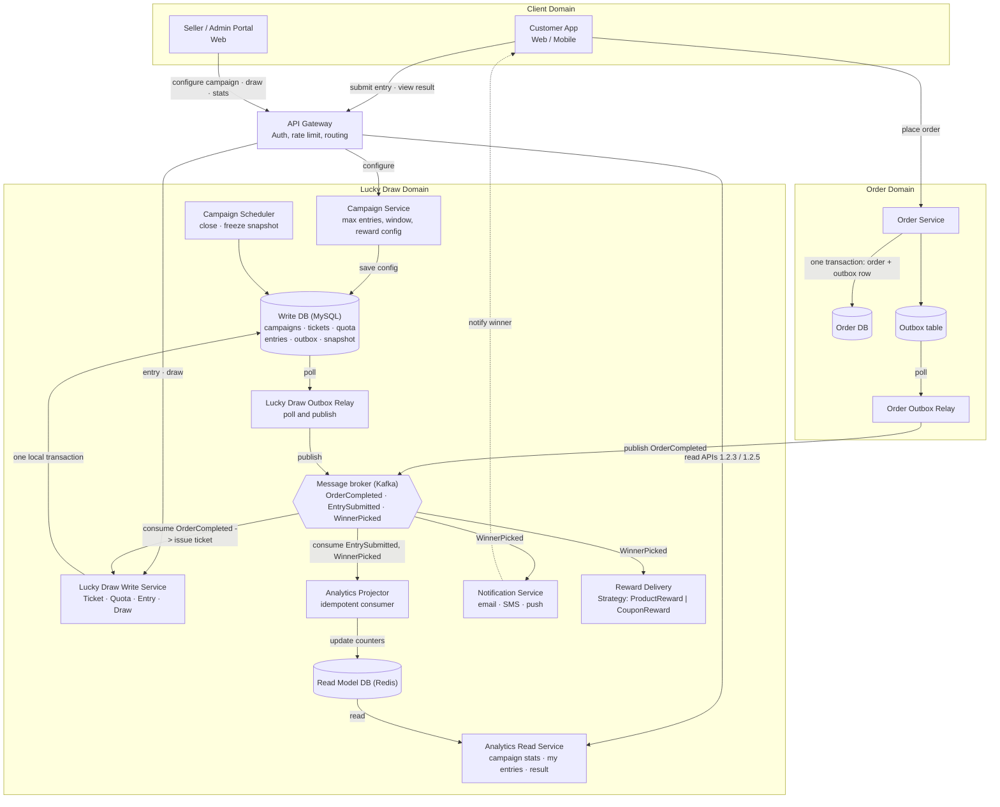

***Fig 1** — Kiến trúc hệ thống: command đi xuống bên trái, projection đi ngược lên bên phải*

Bốn điểm cần chỉ ra trên sơ đồ này khi trình bày:

- **Ô nét đứt không thuộc về nhóm.** `order-service` đã có sẵn trong hệ thống của khách hàng. Hợp đồng duy nhất giữa hai bên là event `OrderCompleted` — nhóm không gọi nó và nó cũng không gọi nhóm. Chính điều đó khiến tính năng loyalty có thể deploy độc lập với checkout.
- **Write side và read side không bao giờ chạm trực tiếp vào nhau.** Write side không tham chiếu tới read model, và read side không thể ghi. Kênh duy nhất nối hai bên là broker — đó là lý do read model scale được độc lập và dựng lại được độc lập.
- **Campaign Service và Lucky Draw Write Service dùng chung một Write DB là có chủ đích.** Transaction submit mở đầu bằng `SELECT campaign FOR SHARE`, nên cấu hình campaign bắt buộc phải nằm cùng database với tickets, quota và entries. Tách ra là đổi một transaction cục bộ lấy một saga — xem mục 1b.
- **Broker là một trục, không phải một bước.** Có năm thành phần gắn vào nó, và thêm cái thứ sáu — ví dụ một consumer sàng lọc gian lận, hay một export báo cáo — không cần sửa bất kỳ thứ gì đã vẽ. Khả năng mở rộng đó chính là phần thưởng cho việc chấp nhận eventual consistency.

#### Trách nhiệm của từng thành phần

| Thành phần | Chịu trách nhiệm | Scale theo |
| --- | --- | --- |
| campaign-service | Cấu hình campaign: giới hạn entry, khung thời gian, loại phần thưởng | Rất hiếm khi ghi; một dòng cho mỗi campaign |
| lucky-draw-write-service | Tiêu thụ ticket, quota, chèn entry, bốc thăm; toàn bộ invariant của campaign | Số request submit |
| Write DB | Trạng thái nguồn: campaigns, tickets, quota, entries, outbox, draw snapshot | Scale dọc, cộng read replica chỉ dùng cho draw snapshot |
| campaign-scheduler | Đóng campaign đúng hạn và đóng băng draw snapshot | Số campaign chạy song song; theo lô, không theo request |
| Outbox relay | Publish event đã commit ít nhất một lần cho mỗi dòng, giữ thứ tự theo aggregate | Độ tồn đọng của outbox |
| analytics-projector | Turning `EntrySubmitted` and `WinnerPicked` | Biến `EntrySubmitted` và `WinnerPicked` thành counter tổng hợp sẵn; khử trùng lặp | Broker lag |
| analytics-service | Phục vụ cả hai API đọc; không ghi gì cả | Lượng truy cập dashboard, độc lập với lượng submit |
| notification-service | Chỉ gửi thông báo cho người thắng | Một lần mỗi campaign; gần như rảnh |
| reward-service | Delivering the prize via `RewardStrategy` | Giao thưởng qua `RewardStrategy`; idempotent, cảnh báo khi lỗi | Một lần mỗi campaign; tính đúng đắn quan trọng hơn throughput rất nhiều |

---

## 1d Sơ đồ Package & Class

*Mục 1d trong đề bài · Phụ trách: Nhóm 3*

*Đề bài yêu cầu hai sơ đồ, và chúng trả lời hai câu hỏi khác nhau. Package diagram cho thấy hướng phụ thuộc giữa các tầng; class diagram cho thấy object nào giữ invariant nào.*

### Package diagram

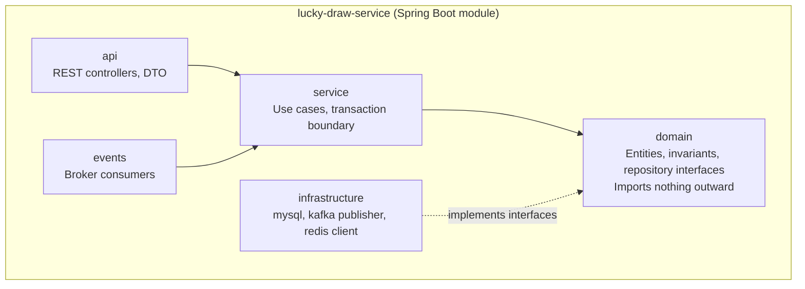

***Fig 2a** — Hướng phụ thuộc giữa các package trong lucky-draw-service*

Mũi tên từ `infrastructure` chạy **ngược lên** `domain`. Đó chính là dependency inversion: `domain` khai báo interface còn `infrastructure` mới là bên implement. Những hệ quả đáng nói thành lời:

- Mọi invariant nghiệp vụ đều test được bằng JUnit thuần, không cần dựng MySQL hay Kafka.
- Đổi store của read model chỉ đụng tới `infrastructure`.
- `events` nằm cạnh `api` vì event consumer chỉ là một cửa vào khác của cùng use case, không phải một tầng riêng.

### Class diagram · mô hình domain

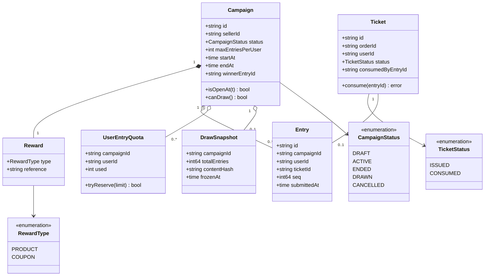

***Fig 2b** — Mô hình domain: quota tách khỏi ticket, snapshot dùng cho bốc thăm, ba enum khai báo đúng chỗ dùng*

| Thành phần | Giữ invariant nào | Cơ chế |
| --- | --- | --- |
| `UserEntryQuota` | Một user không nộp quá `maxEntriesPerUser` entry trong một campaign | Một dòng cho mỗi cặp campaign–user, tăng bằng conditional upsert |
| `Ticket.status` plus unique `orderId` | Mỗi order đủ điều kiện sinh đúng một ticket; mỗi ticket tiêu thụ đúng một lần | Unique constraint chặn event replay ngay ở tầng schema |
| `Entry.seq` | Thứ tự ổn định, để bốc thăm dùng index thay vì OFFSET trên hàng triệu dòng | Cấp từ AUTO_INCREMENT; cho phép có khoảng trống nên không tạo hot row |
| `DrawSnapshot` | Kết quả bốc thăm audit được và không phụ thuộc độ trễ của read model | Đóng băng tập entry lúc campaign kết thúc, ghi lại tổng số kèm content hash |

### Class diagram · service, port và Strategy

```mermaid
classDiagram
  class CampaignService {
    +configure(sellerId, request) Campaign
  }
  class EntryService {
    +submitEntry(userId, campaignId, ticketId) Entry
  }
  class DrawService {
    +pickWinner(campaignId) Entry
  }
  class TicketService {
    +issueForOrder(orderId, userId) Ticket
  }
  class CampaignRepository {
    <<interface>>
    +lockShared(campaignId) Campaign
    +lockExclusive(campaignId) Campaign
    +markDrawn(campaignId, winnerEntryId) bool
  }
  class TicketRepository {
    <<interface>>
    +issueForOrder(orderId, userId) Ticket
    +consume(ticketId, userId, campaignId) bool
  }
  class QuotaRepository {
    <<interface>>
    +tryReserve(campaignId, userId, limit) bool
  }
  class EntryRepository {
    <<interface>>
    +insert(entry) Entry
    +findBySnapshotIndex(campaignId, idx) Entry
  }
  class SnapshotRepository {
    <<interface>>
    +freeze(campaignId) DrawSnapshot
  }
  class DrawAuditRepository {
    <<interface>>
    +record(campaignId, snapshot, idx) void
  }
  class OutboxRepository {
    <<interface>>
    +append(event) void
  }
  CampaignService --> CampaignRepository
  TicketService --> TicketRepository
  EntryService --> CampaignRepository
  EntryService --> TicketRepository
  EntryService --> QuotaRepository
  EntryService --> EntryRepository
  EntryService --> OutboxRepository
  DrawService --> CampaignRepository
  DrawService --> EntryRepository
  DrawService --> SnapshotRepository
  DrawService --> DrawAuditRepository
  DrawService --> OutboxRepository
```

***Fig 2c** — Service phía write và bảy repository interface mà chúng phụ thuộc*

`EntryService` và `DrawService` mỗi bên phụ thuộc vào nhiều repository interface đơn nhiệm thay vì một object unit-of-work dùng chung: điều đó làm rõ ngay trên sơ đồ use case nào chạm vào aggregate nào, và vì vậy một transaction cần bao trọn những gì. `EntryService` chạm tới `CampaignRepository`, `TicketRepository`, `QuotaRepository`, `EntryRepository` và `OutboxRepository` — năm lệnh ghi trong Fig 4. `DrawService` chạm tới `CampaignRepository`, `EntryRepository`, `SnapshotRepository`, `DrawAuditRepository` và `OutboxRepository` — các bước trong Fig 6. Phần phát thưởng cố tình vắng mặt trên sơ đồ này: nó là một consumer độc lập, không phải thứ `DrawService` gọi. Xem Fig 2g.

### State machine của campaign

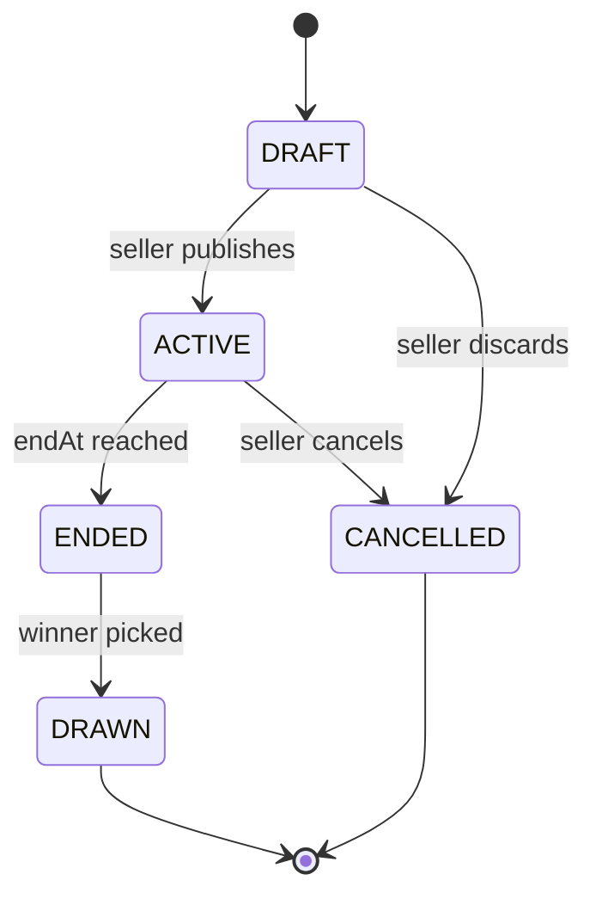

***Fig 2d** — Vòng đời campaign; chỉ nhận entry ở ACTIVE, chỉ bốc thăm ở ENDED*

Chuyển trạng thái ENDED sang DRAWN chính là chỗ đặt idempotency cho việc bốc thăm. Câu `UPDATE campaigns SET status='DRAWN', winner_entry_id=? WHERE id=? AND status='ENDED'` chỉ thành công đúng một lần; lần click thứ hai ảnh hưởng 0 dòng và service trả về người thắng đã có thay vì bốc lại.

### Sơ đồ phụ thuộc giữa các module

Fig 2a cho thấy các package bên trong một module. Câu hỏi team nhận được sau vòng review gần nhất — scale thế nào, mỗi phần deploy ra sao — được trả lời ở tầng module thay vì tầng package, vì module mới chính là đơn vị deploy và scale thật sự.

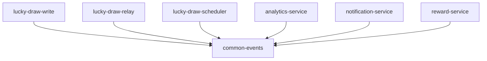

***Fig 2e** — Mọi module Gradle đều phụ thuộc `common-events` để lấy schema event dùng chung; không có gì khác được chia sẻ*

Sáu ứng dụng Spring Boot deploy độc lập, một thư viện dùng chung. Không module nào phụ thuộc trực tiếp vào module ứng dụng khác — thứ duy nhất chúng chia sẻ là schema event, và đường đi duy nhất giữa chúng là broker ở Fig 1. Đó là lý do câu hỏi "scale thế nào" dễ trả lời: mỗi ô trên sơ đồ này có số lượng replica riêng, giới hạn tài nguyên riêng, lượt rollout riêng.

### Class diagram · phía analytics và đọc

`AnalyticsProjector` và hai repository phía đọc mà nó phụ thuộc đã có code ở mục 1f (Fig 7 thể hiện cùng pattern idempotency dưới dạng sequence) nhưng chưa bao giờ được vẽ thành class. Phần này bù lại chỗ thiếu đó.

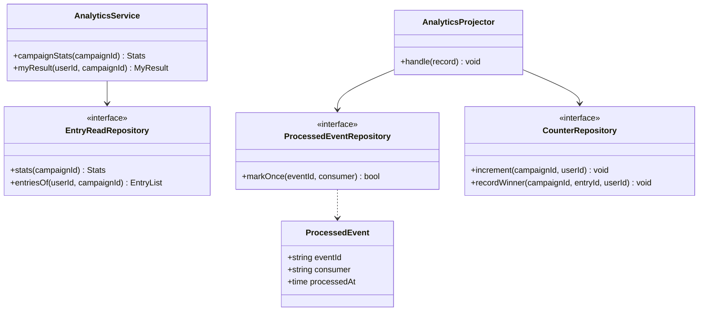

***Fig 2f** — Analytics read service và projector; `ProcessedEvent` là entity đứng sau bảng dedup ở Fig 7*

### Class diagram · phía phát thưởng

Code `WinnerPickedListener` ở mục 1f là nguồn chuẩn ở đây — mọi class và mọi mũi tên bên dưới đọc thẳng từ đó ra, không phải thiết kế mới riêng cho sơ đồ. Fig 2c ở trên hoàn toàn không nhắc tới việc phát thưởng, có chủ đích: đây là nửa còn thiếu.

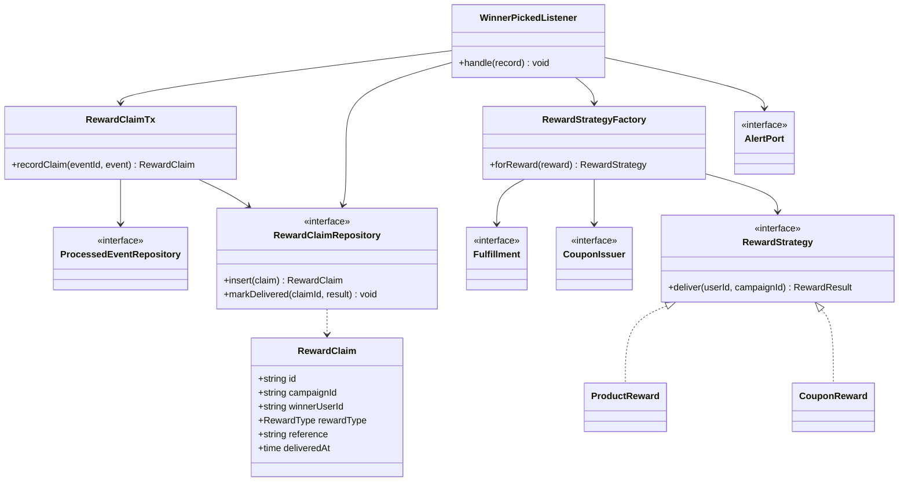

***Fig 2g** — Phát thưởng: claim idempotent, các port ra ngoài, Strategy cho chính việc trả thưởng*

`RewardClaimTx` là transaction ngắn — dedup marker cộng dòng claim, không gì khác. `Fulfillment` và `CouponIssuer` là hai hệ thống bên ngoài mà `RewardStrategyFactory` được dựng ra để cách ly; `AlertPort` là thứ kích hoạt khi một claim không giao được, để một lượt phát thưởng thất bại báo cho người vận hành thay vì biến mất trong một dòng log.

### Invariant nằm trong schema

Class diagram nói *cái gì* phải đúng; schema nói *bằng cách nào*. Mỗi invariant được bảo đảm bằng một constraint hoặc một câu lệnh có điều kiện, không bao giờ bằng một câu `if` trong code ứng dụng — vì `if` không sống sót nổi trước hai request chạy song song.

```sql
-- MySQL 8.0. InnoDB throughout: we depend on row locks and FOR SHARE.
-- Ticket: issued once per order, consumed exactly once
CREATE TABLE tickets (
  id           BINARY(16)  NOT NULL PRIMARY KEY,
  order_id     VARCHAR(64) NOT NULL,
  user_id      VARCHAR(64) NOT NULL,
  status       VARCHAR(16) NOT NULL DEFAULT 'ISSUED',
  campaign_id  VARCHAR(64) NULL,
  consumed_at  DATETIME(6) NULL,
  UNIQUE KEY uq_ticket_order (order_id)
) ENGINE=InnoDB;

-- Quota: entry limit per campaign and user
CREATE TABLE user_entry_quota (
  campaign_id VARCHAR(64) NOT NULL,
  user_id     VARCHAR(64) NOT NULL,
  used        INT         NOT NULL DEFAULT 0,
  PRIMARY KEY (campaign_id, user_id)
) ENGINE=InnoDB;

-- Entry: one ticket yields at most one entry.
-- MySQL has no CREATE SEQUENCE. AUTO_INCREMENT on an indexed column gives the
-- same monotonic ordering with no counter row of our own to contend on. Gaps
-- are fine: only the ordering matters, and the dense index is built later.
CREATE TABLE entries (
  id           BINARY(16)  NOT NULL PRIMARY KEY,
  campaign_id  VARCHAR(64) NOT NULL,
  user_id      VARCHAR(64) NOT NULL,
  ticket_id    BINARY(16)  NOT NULL,
  seq          BIGINT      NOT NULL AUTO_INCREMENT,
  submitted_at DATETIME(6) NOT NULL DEFAULT CURRENT_TIMESTAMP(6),
  UNIQUE KEY uq_entry_seq (seq),
  UNIQUE KEY uq_entry_ticket (ticket_id),
  KEY idx_entries_campaign_seq  (campaign_id, seq),
  KEY idx_entries_campaign_user (campaign_id, user_id)
) ENGINE=InnoDB;

-- Snapshot frozen at campaign end; basis for the draw and for audit
CREATE TABLE draw_snapshot_items (
  campaign_id VARCHAR(64) NOT NULL,
  idx         BIGINT      NOT NULL,
  entry_id    BINARY(16)  NOT NULL,
  PRIMARY KEY (campaign_id, idx)
) ENGINE=InnoDB;

-- Outbox and consumer deduplication
CREATE TABLE outbox (
  id           BINARY(16)  NOT NULL PRIMARY KEY,
  aggregate_id VARCHAR(64) NOT NULL,
  type         VARCHAR(64) NOT NULL,
  payload      JSON        NOT NULL,
  created_at   DATETIME(6) NOT NULL DEFAULT CURRENT_TIMESTAMP(6),
  published_at DATETIME(6) NULL,
  KEY idx_outbox_unpublished (published_at, id)
) ENGINE=InnoDB;

-- The key is (event_id, consumer), not event_id alone: WinnerPicked is
-- consumed by BOTH the analytics projector and the reward service, and each
-- must be allowed to record its own handling of the same event.
CREATE TABLE processed_events (
  event_id     BINARY(16)  NOT NULL,
  consumer     VARCHAR(64) NOT NULL,
  processed_at DATETIME(6) NOT NULL DEFAULT CURRENT_TIMESTAMP(6),
  PRIMARY KEY (event_id, consumer)
) ENGINE=InnoDB;

-- Reward claims: one row per winner, written before the external call
CREATE TABLE reward_claims (
  id             BINARY(16)  NOT NULL PRIMARY KEY,
  campaign_id    VARCHAR(64) NOT NULL,
  winner_user_id VARCHAR(64) NOT NULL,
  reward_type    VARCHAR(16) NOT NULL,
  reference      VARCHAR(64) NOT NULL,
  delivered_at   DATETIME(6) NULL,
  UNIQUE KEY uq_claim_campaign (campaign_id)
) ENGINE=InnoDB;
```

#### Bốn câu lệnh ghi có điều kiện trong transaction submit

```sql
-- 1. Pin the campaign state. MySQL 8.0 supports FOR SHARE (it was
--    LOCK IN SHARE MODE before 8.0.1). Many submits hold this read lock
--    together; only the transaction flipping the campaign to ENDED waits.
SELECT status, max_entries_per_user, start_at, end_at
  FROM campaigns WHERE id = ? FOR SHARE;

-- 2. Consume the ticket. Zero affected rows means the ticket is not this
--    user's, or a concurrent request already spent it.
UPDATE tickets
   SET status = 'CONSUMED', campaign_id = ?, consumed_at = NOW(6)
 WHERE id = ? AND user_id = ? AND status = 'ISSUED';

-- 3. Reserve one quota slot. MySQL has no
--    "ON CONFLICT ... DO UPDATE ... WHERE ... RETURNING", so the guard moves
--    into the UPDATE's WHERE clause and the answer is the affected row count.
--    Two statements, still one transaction, still race-free.
INSERT IGNORE INTO user_entry_quota (campaign_id, user_id, used) VALUES (?, ?, 0);

UPDATE user_entry_quota
   SET used = used + 1
 WHERE campaign_id = ? AND user_id = ? AND used < ?;
-- 0 rows affected => the user is already at the cap => roll back, return 409

-- 4. Write the entry and the outbox event in the same transaction
INSERT INTO entries (id, campaign_id, user_id, ticket_id) VALUES (?, ?, ?, ?);
INSERT INTO outbox  (id, aggregate_id, type, payload) VALUES (?, ?, 'EntrySubmitted', ?);
```

> ℹ️ **Ghi chú**
> **Lập luận kiến trúc mạnh nhất trong hồ sơ, và nó xứng đáng có một slide riêng.** Bốn lệnh ghi này tạo thành *một transaction ACID cục bộ* — không saga, không compensating transaction, không distributed lock. Điều đó chỉ khả thi vì write side được thiết kế có chủ đích là **một bounded context với một database**. Tách ticket và entry thành hai service riêng là bạn phải viết saga kèm bù trừ cho một thao tác vốn xứng đáng chỉ một `BEGIN…COMMIT`. Hãy chủ động nêu điều này thay vì đợi bị hỏi.

#### Đóng băng snapshot khi campaign kết thúc

```sql
-- Runs once, when the campaign moves to ENDED. No new entries can arrive,
-- so ROW_NUMBER (MySQL 8.0 window function) yields a dense, stable sequence.
INSERT INTO draw_snapshot_items (campaign_id, idx, entry_id)
SELECT campaign_id, ROW_NUMBER() OVER (ORDER BY seq), id
  FROM entries WHERE campaign_id = ?;
```

O(n) một lần cho mỗi campaign, đổi lấy việc biến thao tác bốc thăm thành một lần tra theo primary key. Nguyên tắc: **tối ưu đường nóng chạy hàng triệu lần, giữ đường lạnh đủ đơn giản để audit**. Đây cũng là câu trả lời cho phản biện "OFFSET trên hàng triệu dòng thì chậm chứ".

---

## 1e Sequence diagram cho các tính năng chính

*Mục 1e trong đề bài · Phụ trách: Nhóm 3*

*Bốn sơ đồ phủ hết năm API trong đề bài. Hai sơ đồ nữa mô tả các tình huống lỗi mà thiết kế tuyên bố xử lý được — hai cái này chủ yếu là đạn dược cho phần Q&A, có thể bỏ khỏi phần nói nếu thiếu giờ.*

### 1.2.1 · Giao dịch order và phát ticket

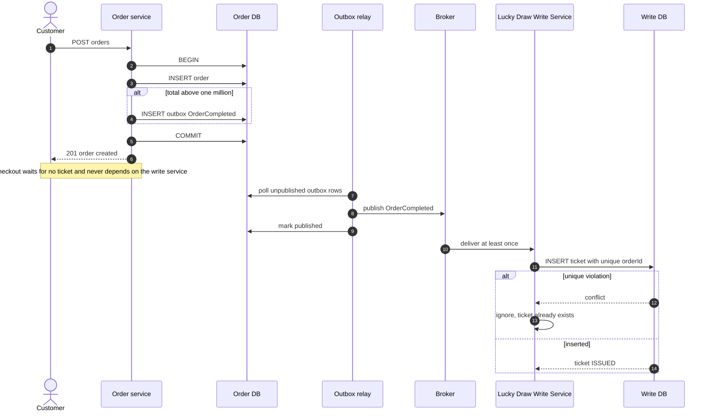

***Fig 3** — Phát ticket bất đồng bộ qua Outbox; unique orderId chặn replay*

> ℹ️ **Ghi chú**
> **Việc phát ticket ghi vào đúng Write DB dùng chung với mọi thứ khác.** Một bản trước đây vẽ riêng một "Ticket service" với "Ticket DB" của chính nó ở đây — điều đó mâu thuẫn với lập luận trung tâm ở mục 1b rằng ticket, quota và entry dùng chung một database chính vì cần commit trong cùng một transaction cục bộ. Consumer ở trên là một Kafka listener nằm bên trong `lucky-draw-write`, và câu `INSERT` ghi vào đúng `Write DB` đã thấy ở Fig 4 và Fig 6.

Unique constraint trên `order_id` khiến consumer này trở nên idempotent *mà không cần bảng dedup* — dạng idempotency rẻ nhất là tái dùng chính khoá nghiệp vụ tự nhiên. Bảng `processed_events` chỉ cần cho những consumer không có khoá như vậy, ví dụ projector cộng counter.

### 1.2.2 · Nộp entry bốc thăm

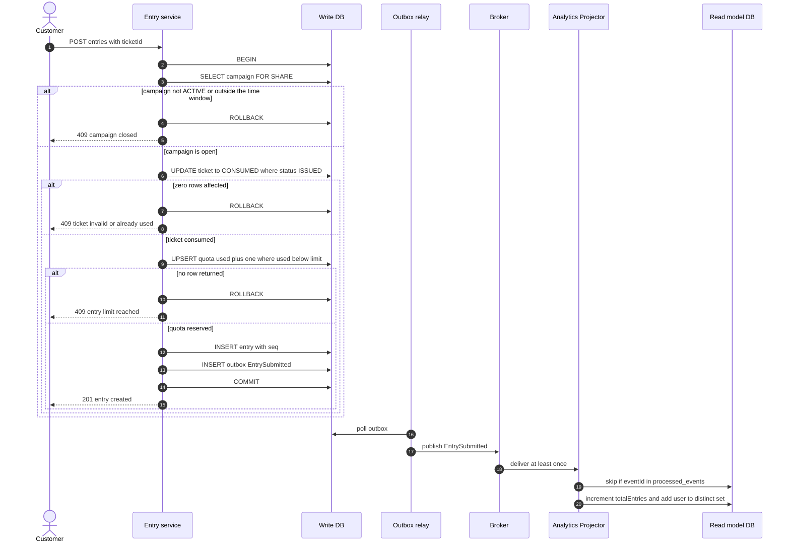

***Fig 4** — Submit entry: bốn lệnh ghi trong một transaction, mỗi bước phát hiện lỗi qua số row*

Ba nhánh `409` khác nhau là có chủ đích. Khách hàng cần biết mình bị từ chối vì campaign đã đóng, vì ticket không hợp lệ, hay vì đã hết lượt — ba tình huống dẫn tới ba hành động khác nhau. Gộp cả ba vào một thông báo chung là lỗi thiết kế API, không phải chi tiết UI.

### 1.2.3 và 1.2.5 · Xem analytics và kết quả

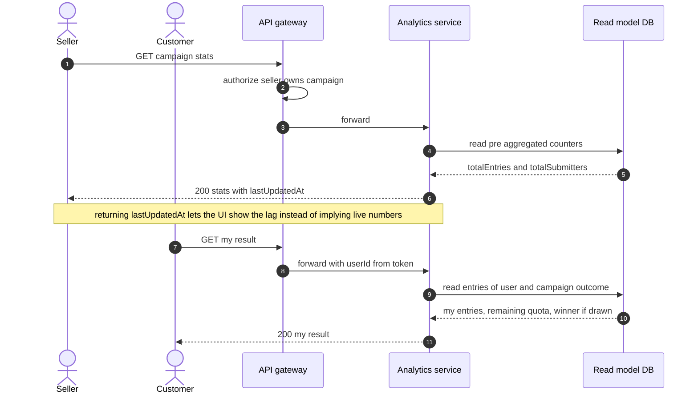

***Fig 5** — Cả hai API đọc đều được phục vụ hoàn toàn từ read model*

Read model có độ trễ, và cách phản ứng đúng không phải là giấu nó đi mà là phơi nó ra. Thiếu `lastUpdatedAt`, một seller thấy số liệu lệch sẽ báo bug và team không có gì để giải thích.

### 1.2.4 · Seller bốc thăm chọn người thắng

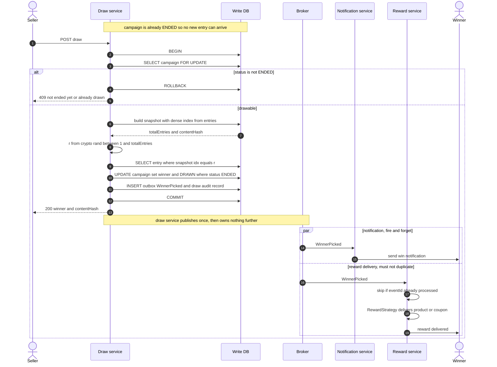

***Fig 6** — Bốc thăm từ snapshot đóng băng của write model; reward và notification tách thành hai consumer độc lập*

Notification và reward được tách thành hai consumer là có chủ đích. Thông báo gửi trùng thì vô hại — người thắng nhận hai tin nhắn giống nhau. Reward giao trùng là thiệt hại tài chính thật: phát hai coupon, hoặc xuất kho hai sản phẩm. Tách ra cho phép mỗi bên mang chính sách retry và idempotency khớp với mức rủi ro của riêng nó. `Notification Service` retry vài lần rồi bỏ cũng được; `Reward Service` thì không, và một lượt giao thất bại phải cảnh báo cho người vận hành chứ không được âm thầm bỏ qua.

### Event trùng lặp và at-least-once delivery

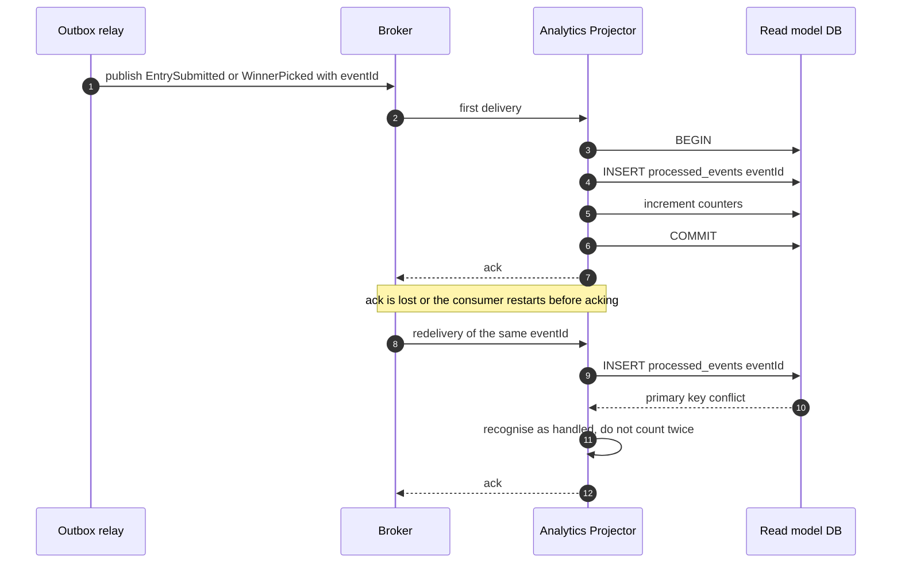

***Fig 7** — Consumer idempotent: dedup và cộng counter trong cùng một transaction*

Chi tiết quyết định tính đúng đắn: câu `INSERT processed_events` và việc cộng counter phải nằm **trong cùng một transaction**. Tách ra thì một lần crash giữa hai bước sẽ để lại một trong hai trạng thái sai — đánh dấu đã xử lý mà chưa cộng, hoặc cộng rồi mà chưa đánh dấu nên lần gửi sau lại cộng thêm.

### Race khi campaign đóng

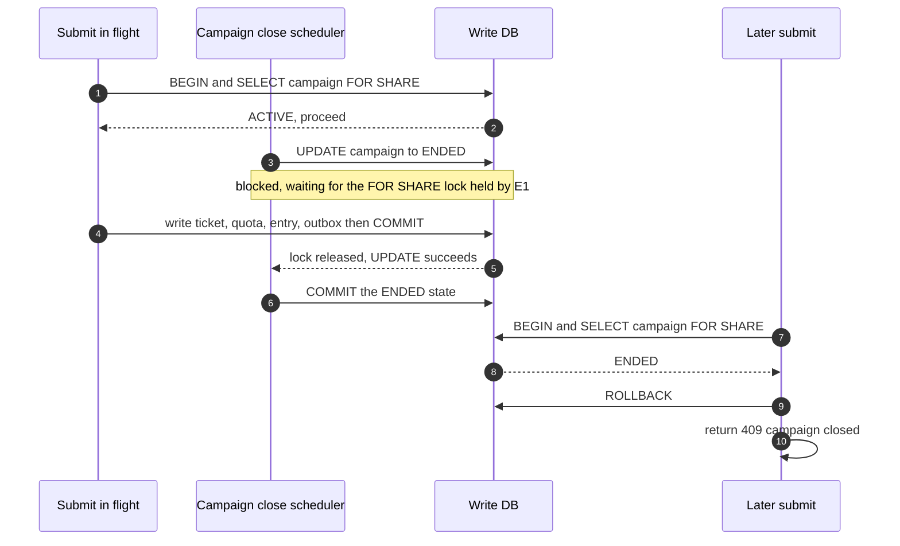

***Fig 8** — `FOR SHARE` cho phép nhiều submit chạy song song nhưng chặn việc đóng campaign giữa chừng*

Vì sao dùng `FOR SHARE` chứ không phải `FOR UPDATE` ở bước 1 của luồng submit: `FOR UPDATE` sẽ serialize *mọi* lượt submit của một campaign qua đúng một dòng — chính là nút cổ chai cần tránh với một seller nổi tiếng. `FOR SHARE` cho hàng nghìn lượt submit cùng giữ khoá đọc, và chỉ chặn đúng transaction muốn *đổi* trạng thái campaign.

#### Tổng hợp API

| API trong đề bài | Endpoint | Phía | Response đáng chú ý |
| --- | --- | --- | --- |
| 1.2.1 | POST /orders | Order service, ghi | `201`; ticket được phát bất đồng bộ sau đó |
| 1.2.2 | POST /campaigns/{id}/entries | Ghi | `201`; `409` campaign đã đóng / ticket không dùng được / hết lượt |
| 1.2.3 | GET /campaigns/{id}/stats | Đọc | `200` with `lastUpdatedAt`; `403` not your campaign |
| 1.2.4 | POST /campaigns/{id}/draw | Ghi | `200` kèm người thắng và `contentHash`; `409` chưa kết thúc hoặc đã bốc rồi |
| 1.2.5 | GET /campaigns/{id}/me | Đọc | `200` danh sách entry, số lượt còn lại, kết quả |

---

## 1f Cấu trúc project và các đoạn code chính

*Mục 1f trong đề bài · Phụ trách: Nhóm 4*

*Bố cục thư mục là hiện thực hoá của package diagram. Một lần build Gradle multi-project sinh ra sáu ứng dụng Spring Boot — write API, outbox relay, scheduler, analytics projector, notification service và reward worker — cho phép scale và deploy từng cái độc lập mà không phải tách codebase thành sáu repository.*

### Project structure

```java
lucky-draw/                             # Gradle multi-project, mot Git repo
├── settings.gradle.kts                 # include(...) moi module mot dong
├── build.gradle.kts                    # cau hinh dung chung trong subprojects { }
├── gradle/
│   └── libs.versions.toml              # version catalog: khai bao phien ban mot cho duy nhat
├── gradlew  ·  gradlew.bat             # wrapper: cung mot ban Gradle o moi noi
│
├── common-events/                      # schema event dung chung, khong dinh Spring
│   ├── build.gradle.kts
│   └── src/main/java/.../events/
│       ├── OrderCompleted.java
│       ├── EntrySubmitted.java
│       └── WinnerPicked.java
│
├── lucky-draw-write/                   # Spring Boot app: the whole write side
│   ├── build.gradle.kts                # bootJar sinh ra file chay duoc
│   └── src/main/
│       ├── java/com/marketplace/luckydraw/
│       │   ├── api/                    # REST controller, DTO
│       │   │   ├── CampaignController.java
│       │   │   ├── EntryController.java
│       │   │   ├── DrawController.java
│       │   │   └── dto/
│       │   ├── events/                 # Kafka listener chieu vao
│       │   │   └── OrderCompletedListener.java
│       │   ├── service/                # use case, ranh gioi @Transactional
│       │   │   ├── CampaignService.java
│       │   │   ├── EntryService.java
│       │   │   ├── DrawService.java
│       │   │   └── TicketService.java
│       │   ├── domain/                 # khong import ra ngoai
│       │   │   ├── Campaign.java
│       │   │   ├── Ticket.java
│       │   │   ├── Entry.java
│       │   │   ├── UserEntryQuota.java
│       │   │   ├── Reward.java
│       │   │   ├── DrawSnapshot.java
│       │   │   ├── DomainExceptions.java
│       │   │   └── port/               # INTERFACE repository khai bao o day
│       │   │       ├── CampaignRepository.java
│       │   │       ├── TicketRepository.java
│       │   │       ├── QuotaRepository.java
│       │   │       ├── EntryRepository.java
│       │   │       └── OutboxRepository.java
│       │   └── infrastructure/         # implement cac interface trong port
│       │       ├── mysql/
│       │       │   ├── JdbcCampaignRepository.java
│       │       │   ├── JdbcTicketRepository.java
│       │       │   ├── JdbcQuotaRepository.java
│       │       │   ├── JdbcEntryRepository.java
│       │       │   ├── JdbcSnapshotRepository.java
│       │       │   └── JdbcOutboxRepository.java
│       │       └── kafka/KafkaEventPublisher.java
│       └── resources/
│           ├── application.yml
│           └── db/migration/           # Flyway
│               ├── V1__campaigns.sql
│               ├── V2__tickets.sql
│               ├── V3__entries_quota.sql
│               ├── V4__outbox_processed.sql
│               ├── V5__draw_snapshot.sql
│               └── V6__reward_claims.sql
│
├── lucky-draw-relay/                   # outbox relay day len Kafka
├── lucky-draw-scheduler/               # ACTIVE sang ENDED, dong bang snapshot
├── analytics-service/                  # projector + API doc, Redis
├── notification-service/               # chi gui thong bao nguoi thang
├── reward-service/                     # consumer WinnerPicked, giao thuong
└── deploy/docker-compose.yml
```

Chú ý rằng package `port` nằm bên trong `domain`, không phải trong `infrastructure`. Chính quyết định đặt chỗ đó khiến mũi tên đi lên trong Fig 2a là sự thật, và rất đáng chỉ vào lúc trình bày vì đó là dòng duy nhất trong cấu trúc mà người review kiểm tra được ngay lập tức.

### Domain: invariant mà không dính infrastructure

```java
package com.marketplace.luckydraw.domain;

public enum CampaignStatus { DRAFT, ACTIVE, ENDED, DRAWN, CANCELLED }

public record Campaign(
        String         id,
        String         sellerId,
        CampaignStatus status,
        int            maxEntriesPerUser,
        Instant        startAt,
        Instant        endAt,
        Reward         reward,
        String         winnerEntryId
) {

    /** The only place the "campaign is accepting entries" rule lives. */
    public boolean isOpenAt(Instant now) {
        return status == CampaignStatus.ACTIVE
                && !now.isBefore(startAt)
                && now.isBefore(endAt);
    }

    public boolean canDraw() {
        return status == CampaignStatus.ENDED;
    }
}
```

```java
package com.marketplace.luckydraw.domain.port;

// Interfaces are declared in the innermost package and implemented out in
// infrastructure.mysql. This is the dependency inversion in Fig 2a.
//
// Note what is NOT here: no transaction handle is passed around. Spring binds
// the JDBC connection to the thread, so @Transactional on the service method
// is enough - the repositories simply enlist in whatever transaction is open.

public interface CampaignRepository {
    Optional<Campaign> lockShared(String campaignId);     // SELECT ... FOR SHARE
    Optional<Campaign> lockExclusive(String campaignId);  // SELECT ... FOR UPDATE
    boolean markDrawn(String campaignId, String winnerEntryId);
}

public interface TicketRepository {
    Ticket  issueForOrder(String orderId, String userId);
    boolean consume(String ticketId, String userId, String campaignId);
}

public interface QuotaRepository {
    boolean tryReserve(String campaignId, String userId, int limit);
}

public interface EntryRepository {
    Entry insert(Entry entry);
    Entry findBySnapshotIndex(String campaignId, long index);
}

public interface OutboxRepository {
    void append(OutboxEvent event);
}
```

### Use case submit: một transaction, bốn lệnh ghi có điều kiện

Đây là đoạn code quan trọng nhất trong toàn bộ hồ sơ. Mọi thất bại đều được phát hiện từ giá trị boolean trả về bởi một lệnh ghi có điều kiện, không bao giờ từ một lần đọc trước đó.

```java
package com.marketplace.luckydraw.service;

@Service
@RequiredArgsConstructor
public class EntryService {

    private final CampaignRepository campaigns;
    private final TicketRepository   tickets;
    private final QuotaRepository    quota;
    private final EntryRepository    entries;
    private final OutboxRepository   outbox;
    private final Clock              clock;

    /**
     * All four writes commit together or not at all. @Transactional opens one
     * MySQL transaction and every repository below enlists in it: no saga,
     * no compensating transaction, no distributed lock.
     */
    @Transactional
    public Entry submitEntry(String userId, String campaignId, String ticketId) {

        // 1. SELECT ... FOR SHARE: many submits proceed together, but the
        //    ACTIVE -> ENDED transition waits until we commit.
        Campaign campaign = campaigns.lockShared(campaignId)
                .orElseThrow(CampaignNotFoundException::new);

        if (!campaign.isOpenAt(clock.instant())) {
            throw new CampaignClosedException();          // -> 409
        }

        // 2. Consume the ticket. false = not this user's ticket, or a
        //    concurrent request already spent it.
        if (!tickets.consume(ticketId, userId, campaignId)) {
            throw new TicketUnusableException();          // -> 409
        }

        // 3. Reserve a quota slot. Atomic: never SELECT COUNT then INSERT.
        if (!quota.tryReserve(campaignId, userId, campaign.maxEntriesPerUser())) {
            throw new EntryLimitReachedException();       // -> 409
        }

        // 4. Entry and outbox event commit together, or neither does.
        Entry entry = entries.insert(Entry.newFor(campaignId, userId, ticketId));
        outbox.append(OutboxEvent.entrySubmitted(entry));
        return entry;
    }
}
```

### Tính atomic thực sự nằm ở đâu

Code service đọc như một mạch thẳng vì phần kiểm soát đồng thời nằm trong SQL. Đây là repository đứng sau bước 3.

```java
package com.marketplace.luckydraw.infrastructure.mysql;

@Repository
@RequiredArgsConstructor
public class JdbcQuotaRepository implements QuotaRepository {

    private static final String ENSURE_ROW = """
            INSERT IGNORE INTO user_entry_quota (campaign_id, user_id, used)
            VALUES (?, ?, 0)
            """;

    private static final String RESERVE = """
            UPDATE user_entry_quota
               SET used = used + 1
             WHERE campaign_id = ? AND user_id = ? AND used < ?
            """;

    private final JdbcTemplate jdbc;

    /**
     * MySQL has no "ON CONFLICT ... DO UPDATE ... WHERE ... RETURNING", so the
     * cap check moves into the UPDATE's WHERE clause and the answer is the
     * affected row count. Two statements, one transaction, still race-free.
     *
     * Because the WHERE clause guarantees the value changes whenever it
     * matches, this is correct regardless of the driver's useAffectedRows
     * setting - matched rows and changed rows are the same number here.
     */
    @Override
    public boolean tryReserve(String campaignId, String userId, int limit) {
        jdbc.update(ENSURE_ROW, campaignId, userId);
        // 0 rows updated is not an error: the user is simply at the cap.
        return jdbc.update(RESERVE, campaignId, userId, limit) == 1;
    }
}
```

### Bốc thăm: đúng nguồn, phân bố đều, idempotent, audit được

```java
package com.marketplace.luckydraw.service;

@Service
@RequiredArgsConstructor
public class DrawService {

    private static final SecureRandom RANDOM = new SecureRandom();

    private final CampaignRepository campaigns;
    private final EntryRepository    entries;
    private final SnapshotRepository snapshots;
    private final DrawAuditRepository audit;
    private final OutboxRepository   outbox;

    @Transactional
    public Entry pickWinner(String campaignId) {

        Campaign campaign = campaigns.lockExclusive(campaignId)
                .orElseThrow(CampaignNotFoundException::new);

        // Idempotent: a second click returns the same winner, never a new one.
        if (campaign.status() == CampaignStatus.DRAWN) {
            return entries.findById(campaign.winnerEntryId())
                    .orElseThrow(IllegalStateException::new);
        }
        if (!campaign.canDraw()) {
            throw new NotDrawableException();
        }

        // Count from the write model, never from the lagging read model.
        DrawSnapshot snapshot = snapshots.freeze(campaignId);
        if (snapshot.totalEntries() == 0) {
            throw new NoEntriesException();
        }

        long index  = secureIndex(snapshot.totalEntries());
        Entry winner = entries.findBySnapshotIndex(campaignId, index);

        campaigns.markDrawn(campaignId, winner.id());
        audit.record(campaignId, snapshot, index);
        outbox.append(OutboxEvent.winnerPicked(campaignId, winner));
        return winner;
    }

    /**
     * Uniform value in [1, n]. SecureRandom rather than Random, and the
     * bounded nextLong overload (Java 17+) rather than nextLong() % n, which
     * would introduce modulo bias.
     */
    private static long secureIndex(long n) {
        return RANDOM.nextLong(n) + 1;
    }
}
```

### Idempotent consumer

```java
package com.marketplace.analytics.events;

@Component
@RequiredArgsConstructor
public class AnalyticsProjector {

    private final ProcessedEventRepository processed;
    private final CounterRepository        counters;
    private final ObjectMapper             json;

    /**
     * Consumes both EntrySubmitted and WinnerPicked: the read model has to
     * serve the running entry count AND the campaign result for API 1.2.5.
     */
    @KafkaListener(topics = "lucky-draw.events", groupId = "analytics-projector")
    @Transactional
    public void handle(ConsumerRecord<String, String> record) throws Exception {

        UUID eventId = UUID.fromString(record.key());

        // Dedup marker and projection share one transaction. Splitting them
        // would let a crash mark an event handled without counting it.
        if (!processed.markOnce(eventId, "analytics-projector")) {
            return;   // duplicate delivery: ack with no side effect
        }

        String type = header(record, "eventType");
        switch (type) {
            case "EntrySubmitted" -> {
                EntrySubmitted e = json.readValue(record.value(), EntrySubmitted.class);
                counters.increment(e.campaignId(), e.userId());
            }
            case "WinnerPicked" -> {
                WinnerPicked e = json.readValue(record.value(), WinnerPicked.class);
                counters.recordWinner(e.campaignId(), e.winnerEntryId(), e.winnerUserId());
            }
            default -> { /* not ours: ack and move on */ }
        }
    }
}
```

### Strategy for reward delivery

```java
package com.marketplace.reward;

public interface RewardStrategy {
    RewardResult deliver(String userId, String campaignId);
}

@Component
@RequiredArgsConstructor
public class RewardStrategyFactory {

    private final Fulfillment  fulfillment;
    private final CouponIssuer couponIssuer;

    // Adding a third reward type means one new class and one new case here.
    // DrawService and the WinnerPicked listener do not change.
    public RewardStrategy forReward(Reward reward) {
        return switch (reward.type()) {
            case PRODUCT -> new ProductReward(reward.reference(), fulfillment);
            case COUPON  -> new CouponReward(reward.reference(), couponIssuer);
        };
    }
}
```

### Consumer phát thưởng: idempotency ở chỗ sai là mất tiền

Thông báo trùng thì vô hại; phần thưởng trùng thì không. Consumer này commit dedup marker và bản ghi claim trong một transaction *trước khi* gọi hệ thống bên ngoài, nên một lần gửi lại không bao giờ có thể phát coupon thứ hai hay xuất kho lần thứ hai.

```java
package com.marketplace.reward.events;

@Component
@RequiredArgsConstructor
public class WinnerPickedListener {

    private final RewardClaimTx        claimTx;   // holds the @Transactional method
    private final RewardClaimRepository claims;
    private final RewardStrategyFactory factory;
    private final AlertPort            alerts;
    private final ObjectMapper         json;

    @KafkaListener(topics = "lucky-draw.events", groupId = "reward-service")
    public void handle(ConsumerRecord<String, String> record) throws Exception {

        if (!"WinnerPicked".equals(header(record, "eventType"))) return;

        UUID         eventId = UUID.fromString(record.key());
        WinnerPicked event   = json.readValue(record.value(), WinnerPicked.class);

        RewardClaim claim;
        try {
            // Short transaction: dedup marker + claim row, then COMMIT.
            claim = claimTx.recordClaim(eventId, event);
        } catch (AlreadyHandledException e) {
            return;   // redelivery of the same event: ack, do not deliver twice
        }

        // Deliberately OUTSIDE the transaction. A slow fulfillment call must
        // not hold a MySQL row lock open for seconds.
        try {
            RewardResult result = factory.forReward(event.reward())
                    .deliver(event.winnerUserId(), event.campaignId());
            claims.markDelivered(claim.id(), result);
        } catch (RuntimeException e) {
            // Never silently drop a prize: park the claim and page a human.
            alerts.rewardDeliveryFailed(claim, e);
            throw e;
        }
    }
}

@Service
@RequiredArgsConstructor
class RewardClaimTx {

    private final ProcessedEventRepository processed;
    private final RewardClaimRepository    claims;

    @Transactional
    RewardClaim recordClaim(UUID eventId, WinnerPicked event) {
        // PRIMARY KEY (event_id, consumer): a redelivery stops right here.
        if (!processed.markOnce(eventId, "reward-service")) {
            throw new AlreadyHandledException();
        }
        return claims.insert(RewardClaim.from(event));
    }
}
```

---

## 2 Application demo plan

*Mục 2 trong đề bài · Tuỳ chọn, taskforce có thưởng · Phụ trách: Nhóm 4*

*Đề bài có thưởng cho một bản demo chạy được. Đáng làm vì phần lớn code đã có sẵn từ mục 1f — nhưng chỉ làm kèm một bản ghi hình dự phòng, vì demo trực tiếp trên máy lạ ở Hall B là rủi ro không cần thiết.*

#### Phạm vi: thứ nhỏ nhất đủ chứng minh thiết kế

Không phải sản phẩm hoàn chỉnh. Bốn tiến trình trên `docker-compose` — MySQL, một broker tương thích Kafka, API, và relay cộng projector — kèm script seed để trạng thái ban đầu giống hệt nhau mỗi lần chạy.

#### Kịch bản demo, khoảng hai phút

1. **Seed** một campaign với `maxEntriesPerUser = 2` và khung thời gian ngắn.
2. **Tạo ba order**, hai đơn vượt ngưỡng. Cho thấy hai ticket xuất hiện — và lưu ý về độ trễ ngắn, vì độ trễ đó chính là thiết kế đang hoạt động đúng, không phải bug.
3. **Nộp hai entry** thành công, rồi thử nộp cái thứ ba. Cho thấy lỗi `409 entry limit reached`. Đây chính là yêu cầu mà bản thiết kế đầu tiên bỏ sót, nên demo trực tiếp chỗ này là khoảnh khắc mạnh nhất của cả phần demo.
4. **Dùng lại một ticket đã tiêu.** Cho thấy `409 ticket already used`.
5. **Mở dashboard** với trường `lastUpdatedAt`, rồi nộp thêm một entry và refresh để làm cho độ trễ projection hiện ra và được giải thích.
6. **Kết thúc campaign**, chạy bốc thăm, cho thấy người thắng và snapshot hash. Bấm bốc thăm lần thứ hai và cho thấy vẫn ra đúng người đó chứ không phải người mới.
7. **Gửi lại một event** vào broker bằng tay và cho thấy counter không bị cộng hai lần.

> ⚠️ **Cảnh báo**
> **Bắt buộc với phần demo:** quay lại toàn bộ lượt chạy thành video trước ngày 26/8 và để sẵn trên laptop trình bày. Nếu có gì hỏng lúc chạy trực tiếp — mạng, Docker, xung đột cổng, độ phân giải máy chiếu — thì chuyển sang bản ghi hình mà không bình luận gì, và nói tiếp. Mất hai phút trong tổng số 20 vì một demo hỏng thì đắt hơn giá trị của chính bản demo đó.

---

## A Nhật ký lỗi thiết kế

*Ba lỗi thiết kế phát hiện khi rà bản thiết kế đầu tiên của nhóm với đề bài. Chúng được ghi lại ở đây một cách có chủ đích: trình bày một lỗi mà nhóm tự tìm ra và tự sửa thì thuyết phục hơn nhiều so với trình bày một thiết kế chưa từng bị soi.*

#### Lỗi 1 · Sai mô hình — Ticket bị mô hình hoá thành một ví nhiều lượt

Bản đầu cho `Ticket` một bộ đếm `remaining` rồi trừ dần. Nhưng đề bài cấp **một ticket cho mỗi order đủ điều kiện** — ticket gắn với một order và dùng một lần — trong khi giới hạn entry lại thuộc về *campaign*. Một field gánh hai khái niệm không liên quan, nên chẳng giữ được cái nào.

- **Was:** `Ticket{ remaining int }` with a decrement
- **Now:** `Ticket{ orderId unique, status ISSUED|CONSUMED }`; the limit moved to `UserEntryQuota`

#### Lỗi 2 · Thiếu enforce — `maxEntriesPerUser` được khai báo nhưng không bao giờ được enforce

Đây là gạch đầu dòng đầu tiên trong phần cấu hình campaign của đề bài. Field này có trên class diagram, nhưng không có đường code nào và không có sequence diagram nào đọc tới nó — một khách hàng có hai mươi ticket có thể nộp hai mươi entry dù giới hạn là năm.

Cách sửa hiển nhiên cũng sai: `SELECT COUNT(*)` rồi `INSERT` là check-then-act, và hai request đồng thời khi user đang ở lượt 5/5 sẽ cùng đọc ra 4 và cùng thành công.

- **Was:** No check at all
- **Now:** Conditional upsert lên `user_entry_quota`, quyết định bằng số row bị ảnh hưởng

#### Lỗi 3 · Công bằng & idempotency — Bốc thăm đếm từ read model nhưng tra chỉ số trên write model

Bản đầu lấy tổng số entry từ read model bất đồng bộ, rồi tra chỉ số đó trên write model. Khi read model trễ 200 entry, 200 entry cuối cùng vĩnh viễn không thể thắng — đây là lỗi công bằng trong một chương trình có giải thưởng thật, không chỉ là lỗi kỹ thuật. Kèm theo đó: dùng `Random` thay vì `SecureRandom`, và một lệnh cập nhật người thắng không điều kiện mà double-click có thể chạy hai lần.

- **Was:** Đếm từ read model, tra chỉ số trên write model, `Random`, update không điều kiện
- **Now:** `DrawSnapshot` đã hash từ write model, `SecureRandom`, và `UPDATE … WHERE status = 'ENDED'`

## B Kịch bản 20 phút

*Owner: Group 5*

Đề bài cho phép một hoặc hai người trình bày và nói rõ là quá giờ sẽ bị cắt. Nhóm dự kiến hai người: một người gánh phần lập luận, một người gánh phần hiện vật. Ai trình bày mục 1b cũng nên là người dẫn phần Q&A, vì câu hỏi sẽ đổ về đó.

| Phần | Thời lượng | Người nói | Cắt nếu thiếu giờ? |
| --- | --- | --- | --- |
| Mở đầu: giới thiệu nhóm, tóm tắt bài toán trong một câu | 1:00 | A | Không |
| 1a · Pattern selection | 2:00 | A | Không |
| 1b · Các phương án đã loại và trade-off | 4:00 | A | Không — đây là phần trọng tâm được chấm |
| 1c · Sơ đồ kiến trúc, kể theo vòng tròn | 3:00 | B | Không |
| 1d · Package, class, state machine | 2:00 | B | Chỉ show Fig 2a và 2c; bỏ 2b, 2d–2g |
| 1e · Sequence submit entry và bốc thăm | 3:00 | B | Nói là có Fig 7 và 8, đừng đi qua từng bước |
| 1f · Cấu trúc và hai đoạn code | 3:00 | B | Chỉ show use case submit |
| Demo | 2:00 | B | Có — cắt đầu tiên |
| Kết thúc và chuyển sang Q&A | 1:00 | A | Không |

#### Quy tắc cho người trình bày

- **Đừng bao giờ đọc sơ đồ thành lời.** Nói nó chứng minh điều gì, chỉ vào đúng một chi tiết chứng minh điều đó, rồi đi tiếp. Fig 1 kể theo vòng tròn; Fig 2a kể bằng đúng một mũi tên đi lên; Fig 4 kể bằng đúng một transaction.
- **Mở đầu bằng nhật ký lỗi.** Bắt đầu mục 1d bằng câu "chúng tôi tìm ra ba lỗi trong chính bản thiết kế đầu của mình" mang lại uy tín hơn bất kỳ sơ đồ nào, và chặn trước việc hội đồng tự tìm ra chúng.
- **Chủ động nêu trade-off.** Eventual consistency, ticket đến trễ, bề mặt vận hành lớn hơn. Nêu một cái giá trước khi bị hỏi thì đọc ra là có phán đoán; bị bắt bí vì nó thì đọc ra là một lỗ hổng.
- **Nhìn đồng hồ ở lúc bàn giao 1c.** Đó là mốc giữa. Trễ ở điểm đó nghĩa là cắt demo, không phải nén mục 1b.

## C Chuẩn bị Q&A

**Q: Sao không xây luôn một monolith? Campaign nhỏ mà bày vẽ nhiều thứ quá.**

Đề bài nói rõ seller rất nổi tiếng và campaign nào cũng đông người, và lưu lượng bốc thăm không rải đều — nó dồn vào vài giờ cuối. Đó cũng đúng là lúc seller theo dõi dashboard. Trên một store, truy vấn tổng hợp và đường chèn tranh nhau, và lỗi hiện ra dưới dạng độ trễ ghi, rất tốn công chẩn đoán. Nếu bỏ giả định về lưu lượng khỏi đề bài thì layered monolith sẽ là câu trả lời của nhóm.

**Q: Event-driven thì thêm độ trễ chứ? Sao lại chấp nhận được?**

Ticket là quyền lợi khách hàng thân thiết, không phải hàng đã mua, nên vài giây là vô hình với khách. Phương án thay thế là buộc tính sẵn sàng của checkout vào một tính năng loyalty, mà chế độ lỗi của nó là hoặc checkout chậm, hoặc ticket mất âm thầm. Nhóm thà chịu ticket đến hơi trễ còn hơn một trong hai cái đó.

**Q: Sao không kiểm tra giới hạn entry bằng SELECT COUNT(*) rồi INSERT?**

Vì đó là check-then-act. Hai request đồng thời của cùng một user đang ở lượt 5/5 sẽ cùng đọc ra 4 và cùng thành công. Conditional upsert đẩy phép so sánh vào chính câu UPDATE để database serialize giúp ở mức dòng.

**Q: Nếu Ticket và Entry là hai service riêng thì transaction đó còn chạy được không?**

Không, và đó chính xác là lý do chúng không tách. Bạn sẽ cần một saga kèm bù trừ — hoàn ticket khi hết quota — cho một thao tác vốn gọn trong một BEGIN…COMMIT cục bộ. Nhóm vạch ranh giới service theo ranh giới transaction chứ không theo ranh giới bảng.

**Q: Bốn lệnh ghi trong một transaction — có phải nút cổ chai lúc cao điểm không?**

Chúng nhắm vào bốn dòng khác nhau trong cùng một database, nên đây là một transaction cục bộ ngắn, không có round trip giữa các service. Điểm tranh chấp thật là dòng campaign ở bước một, và đó là lý do nhóm dùng FOR SHARE thay vì FOR UPDATE. Nếu vẫn chưa đủ, bước tiếp theo là bỏ khoá campaign và enforce khung thời gian bằng CHECK constraint, chấp nhận sai lệch dưới một giây tại thời điểm campaign đóng.

**Q: Message bị trùng hoặc bị mất thì sao?**

Giao nhận là at-least-once, nên mọi consumer đều idempotent. Việc phát ticket dùng unique order_id — khoá nghiệp vụ làm việc đó. Projector cộng counter không có khoá tự nhiên nên dùng processed_events, và câu insert dedup chia sẻ transaction với lệnh cộng. Message mất được chặn từ đầu nguồn bằng outbox: dòng event commit cùng lúc với thay đổi trạng thái, nên relay luôn publish lại được.

**Q: Đóng băng snapshot trên hàng triệu entry thì chậm chứ?**

Chậm, và nó chạy đúng một lần mỗi campaign trên đường lạnh, không bao giờ chạy đồng thời với lưu lượng submit vì campaign đã kết thúc. Nhóm tối ưu đường chạy hàng triệu lần và giữ đường một-lần-mỗi-campaign đủ đơn giản để audit. Đổi lại, thao tác bốc thăm trở thành một lần tra theo primary key.

**Q: Nếu khách khiếu nại, làm sao chứng minh lượt bốc thăm là công bằng?**

Snapshot là bất biến và đã được hash, và hash đó được ghi trong cùng transaction với người thắng. Công bố hash trước khi công bố người thắng sẽ cho phép bất kỳ ai kiểm chứng rằng tập entry không bị sửa giữa lúc đóng băng và lúc bốc. Chỉ số ngẫu nhiên đến từ SecureRandom với overload có chặn trên, phân bố đều trên khoảng và không có modulo bias.

**Q: Read model lệch với write model. Trả lời khiếu nại thế nào?**

Số liệu analytics là số liệu vận hành, không bao giờ là căn cứ trao giải. Kết quả bốc thăm luôn được tính từ write model qua snapshot. Response của API đọc mang theo lastUpdatedAt để UI nói rõ độ trễ thay vì để người dùng tưởng con số là tức thời.

**Q: Nếu lưu lượng gấp mười lần giả định thì thiết kế này vỡ ở đâu trước?**

Khoá dòng campaign ở bước một của transaction submit, rồi tới throughput của outbox relay. Cả hai đều không đòi hỏi thiết kế lại: khoá có thể thay bằng CHECK constraint trên khung thời gian, và relay có thể phân mảnh theo campaign id. Không có gì trong thiết kế hiện tại phải làm ngược lại để thực hiện một trong hai, và đó là lý do chính nhóm chọn nó thay vì các phương án ở mục 1b.

## D Phân công & checklist trước khi nộp

| Nhóm | Số người | Sản phẩm bàn giao |
| --- | --- | --- |
| Nhóm 1 | 2 | Mục 1a và 1b; sở hữu bảng phương án bị loại và phần kinh nghiệm dẫn chứng; dẫn phần Q&A |
| Nhóm 2 | 2 | Mục 1c; sở hữu Fig 1 và bảng trách nhiệm thành phần |
| Nhóm 3 | 2 | Mục 1d và 1e; sở hữu Fig 2a–2g và Fig 3–8, schema, và nhật ký lỗi |
| Nhóm 4 | 3 | Mục 1f và phần demo; sở hữu code, script seed, và bản ghi hình dự phòng |
| Nhóm 5 | 1 | Tài liệu này, bộ slide, kịch bản, canh giờ tổng duyệt; trình bày cùng một thành viên Nhóm 1 |

#### Trước khi nộp ngày 14/8

- [ ] Mọi dòng trong bảng đối chiếu ở mục 00 đều trỏ tới một phần thực sự tồn tại và đã hoàn chỉnh.
- [ ] Các chỗ trống trong ngoặc vuông ở khối **Experience cited** của mục 1b đã được thay bằng dự án thật, hoặc phần khẳng định đó đã được bỏ đi.
- [ ] Code ở mục 1f khớp với sơ đồ ở 1d và 1e — cụ thể, không còn bộ đếm `remaining` sót lại ở đâu, việc bốc thăm đọc từ snapshot, và phần giao thưởng nằm trong consumer riêng của nó chứ không nằm trong luồng bốc thăm hay luồng notification.
- [ ] Toàn bộ hình — Fig 1, 2a–2g, và 3–8 — đã export ở 2× trở lên và đưa vào slide.
- [ ] Đã tổng duyệt trọn 20 phút một lần với đúng hai người trình bày và có bấm giờ.
- [ ] Đã quay bản demo và copy sang laptop trình bày.
- [ ] Sơ đồ render được offline, hoặc hình đã nhúng dạng ảnh để file nộp không cần mạng.

> ℹ️ **Ghi chú**
> **Về file này và vấn đề mạng:** các sơ đồ trong file này được vẽ bằng Mermaid nạp từ CDN, và mỗi sơ đồ đã render đều có link *Download SVG*. Trước khi nộp bản cuối, hãy export các hình và nhúng thẳng vào tài liệu, để bản nộp không phụ thuộc vào việc Hall B có mạng hay không. Mã nguồn Mermaid của mỗi sơ đồ nằm trong khối có thể mở ra ngay bên dưới nó.

---

*Hồ sơ đề xuất v2.1 · Lucky Draw System · Workshop Design Software Architecture · Nộp 14/8, trình bày 26/8*